# Операционные системы UNIX/Linux (Базовый)
## Part 1. Установка ОС

- Выполнив команду `cat /etc/issue`, узнаем версию Ubuntu.

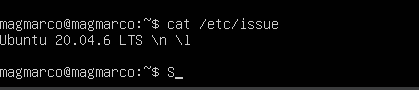

## Part 2. Создание пользователя

- Используя команду `sudo adduser newuser`, создадим нового пользователя.

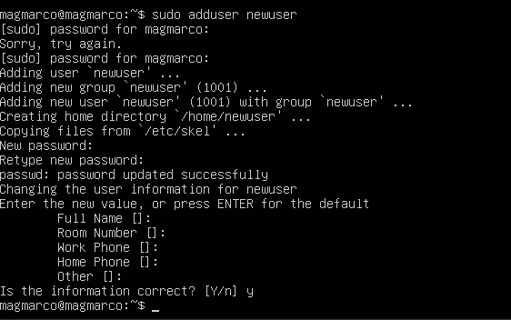

- С помощью команды `sudo usermode -a -G` можно добавить нового пользователя в группу `adm`.

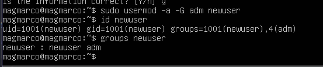

- Вывод команды `cat /etc/passwd`.

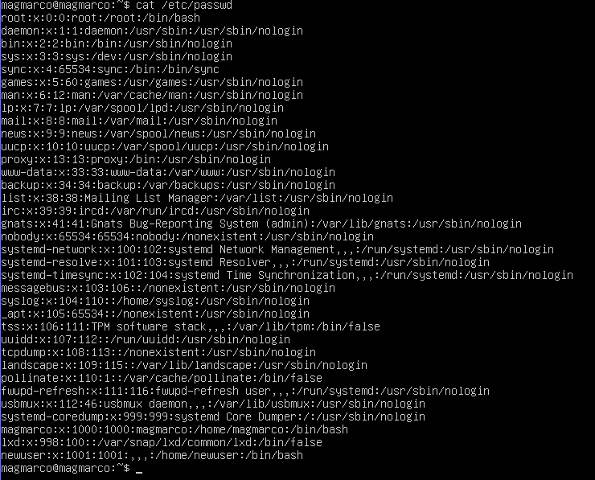

## Part 3. Настройка сети ОС

- Команда `hostname` проверяет название ОС машины.
- Используя команду `sudo hostnamectl set-hostname user-1`, задаём новое имя машине.

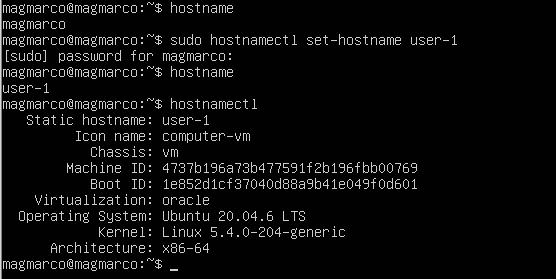

- Далее устанавливаем временную зону, соответсвующую текущему местоположению. Используем команду `sudo timedatectl set-timezone Europe/Moscow`.

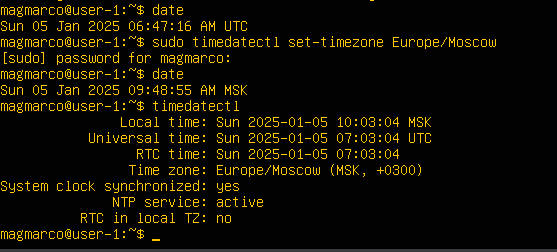

- Команды `ip l` `ip address` `ls /sys/class/net` выводят названия сетевых интерфейсов, сосотояние и т.д.

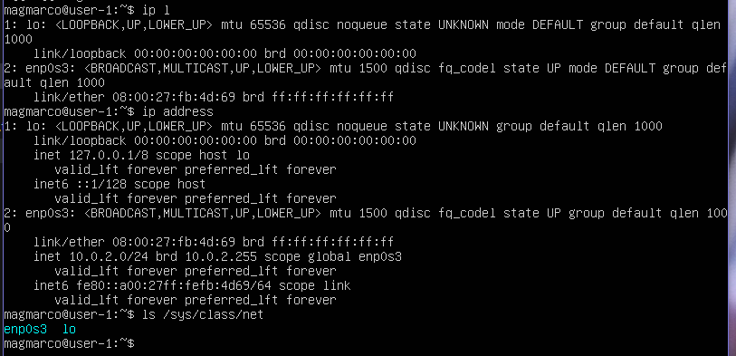

Интерфейс lo (loopback device) — это локальная петля, которая имеет IP-адрес 127.0.0.1 и используется для отладки сетевых программ и запуска серверных приложений на локальной машине. 

- Используя консольную команду `cat /var/log/syslog | grep -i dhcp`, получим ip адрес от DHCP-сервера.

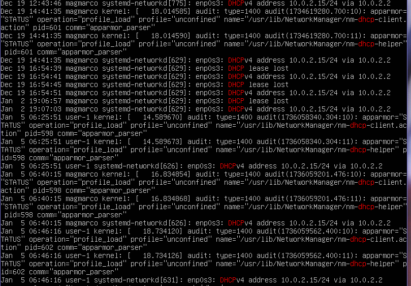

ip адрес от DHCP-сервера моего устройства 10.0.2.15/24

DHCP - Dynamic Host Configuration Protocol (протокол динамической конфигурации хоста).

- `curl ifconfig.co` - вывод внешнего ip-адреса шлюза (ip)
`ip route` `route -n` - выводит внутренний IP-адрес шлюза, он же ip-адрес по умолчанию (gw).

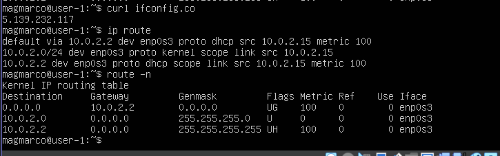

- внешний IP-адрес шлюза: 5.139.222.117; внутренний IP-адрес шлюза: 10.0.2.2

- Для того чтобы задать статичные (заданные вручную, а не полученные от DHCP-сервера) настройки ip, gw, dns,  необходимо отключить облачную инициализацию. Нужно открыть файл конфигурации `subiquity-disable-cloudinit-networking.cfg` в каталоге `/etc/cloud/cloud.cfg.d/` с помощью команды 
`sudo vim /etc/cloud/cloud.cfg.d/subiquity-disable-cloudinit-networking.cfg`.

- Удостоверимся, что `config: disabled`.

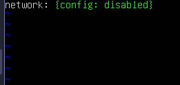

- Далее открываем файл конфигурации `netplan 00-installer-config.yaml` для редактирвания командой `sudo vim /etc/netplan/00-installer-config.yaml`.

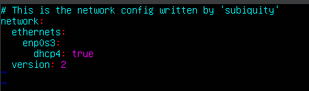

- Заменяем параметр dhcp на false, статический IP адрес сервера на 10.0.2.0/24, указываем шлюз 10.0.2.2, в разделе nameservers используем публичные DNS-серверы, например 1.1.1.1 или 8.8.8.8.

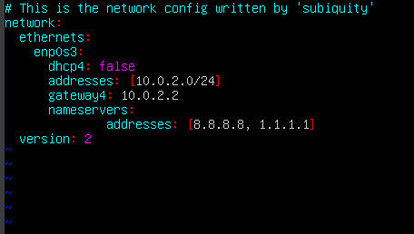

- Перезагружаем виртуальную машину. Статичные сетевые настройки (ip, gw, dns) соответствуют заданным в предыдущем пункте.

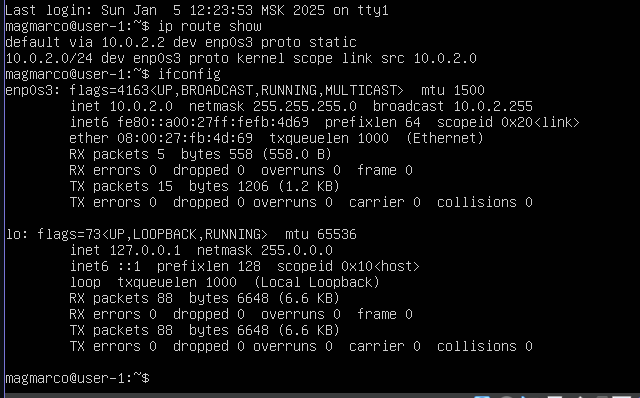

- Пропингуем удаленные хосты 1.1.1.1 и ya.ru.

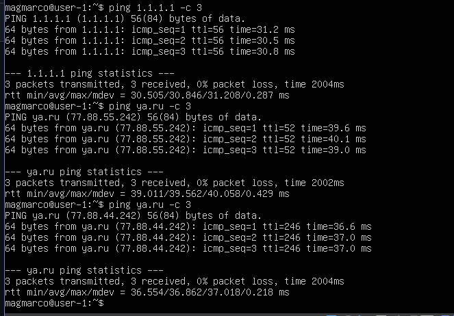

## Part4. Обновление ОС

- Обновим системные пакеты до последней на момент выполнения задания версии командами `sudo apt update` `sudo apt full-upgrade`.

- При повторном вызове команды `sudo apt full-upgrade` получено сообщение об отсутствии новых обновлений.

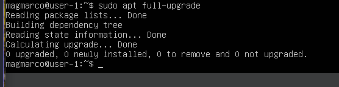

## Part 5. Использование команды sudo

Sudo в Linux — это утилита, позволяющая пользователю запускать программы с привилегиями другой учётной записи, как правило, суперпользователя. Она временно повышает привилегии, позволяя пользователям выполнять конфиденциальные задачи без входа в систему как пользователь root.

- Чтобы разрешить пользователю, созданному в [Part 2](#part-2-создание-пользователя), выполнять команду `sudo`, необходимо добавить его в группу `sudo`.

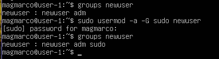

- Поменяем hostname ОС от имени пользователя, созданного в пункте [Part 2](#part-2-создание-пользователя) (используя sudo).

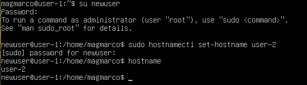

- Перезагрузим систему и проверим hostname ОС.

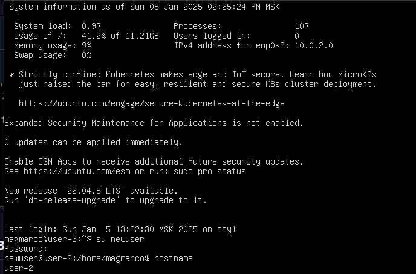

## Part 6. Установка и настройка службы времени

- Команда `timedatectl show` выводит время часового пояса, в котором пользователь сейчас находится.

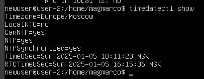

## Part 7. Установка и использование текстовых редакторов

- `vim test_vim.txt`- создать и открыть файл в vim.
- Для редактирования файла надо нажать клавишу `i`.
- Для выхода с сохранением изменений нужно нажать на `ESC`, затем ввести `:wq`.

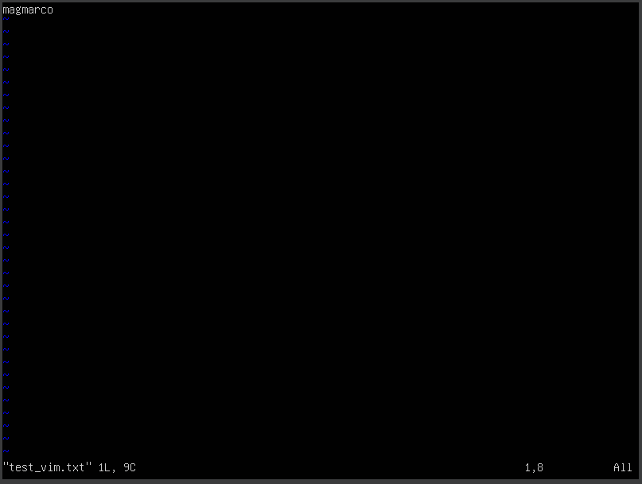

- Запускаем редактор `nano` без параметров, пишем свой никнейм. Для сохранения изменений нажимаем `Ctrl+S`, вводим название файла. Для выхода нажимаем `Ctrl+X`.

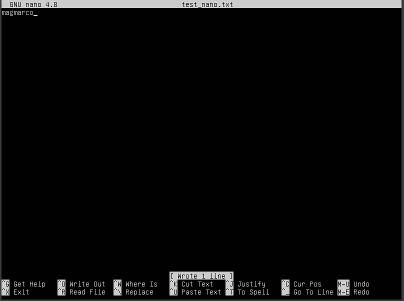

- Запускаем редактор `mcedit` без параметров, пишем свой никнейм. Для сохранения изменений нажимаем `F2`, вводим название файла. Для выхода нажимаем `F10` и `Yes`.

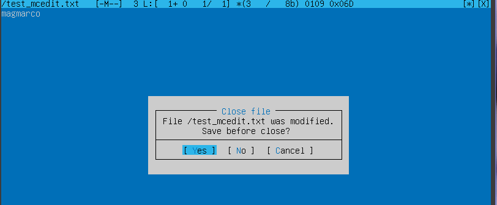

- Для выхода без сохранения изменений в vim нажимаем на `ESC`, затем вводим `:q!`.

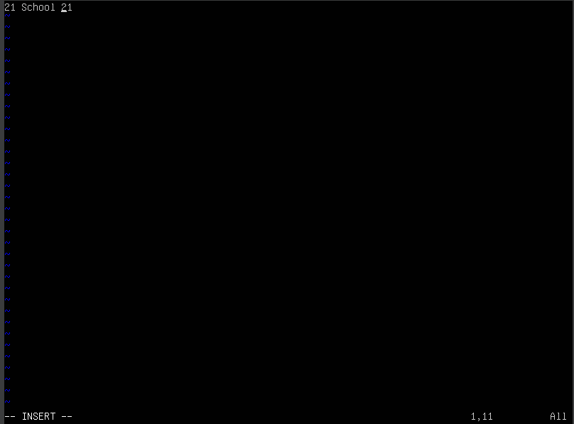

- Проверим, что изменения не сохранились.

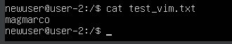

- Для выхода без сохранения изменений в nano нажимаем на `Ctrl+X`, затем на `N`.

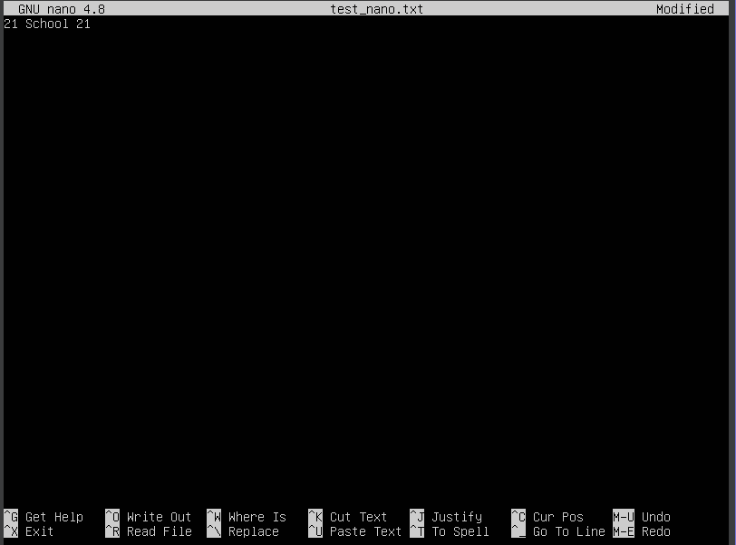

- Проверим, что изменения не сохранились.

- Для выхода без сохранения изменений в mcedit нажимаем на `F10`, затем выбираем `No`.

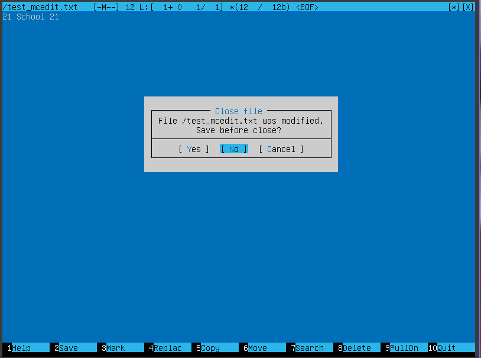

- Проверим, что изменения не сохранились.

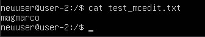

- Поиск слов в vim осуществляется с помощью команды `/\<word\`.

- Замена слова в vim`:s/old/new`.

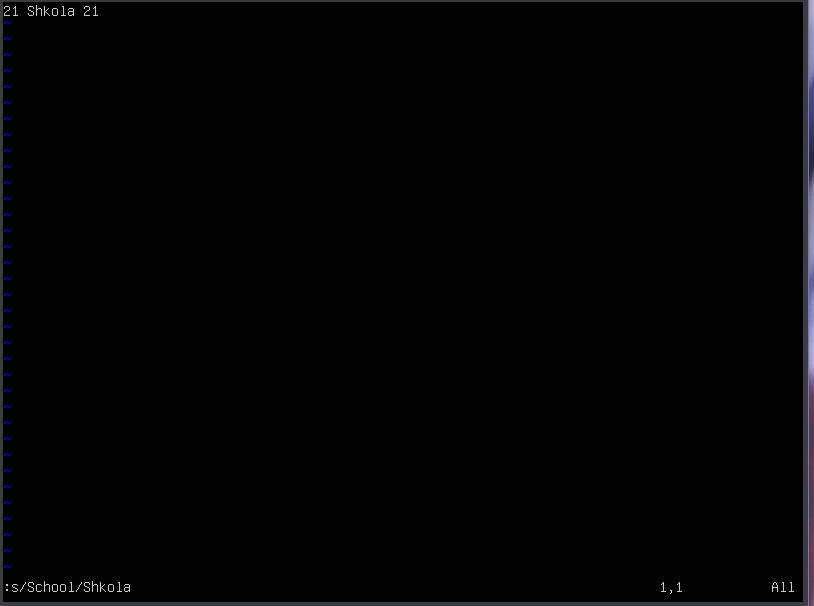

- Поиск слов в nano- `ctrl+W`.

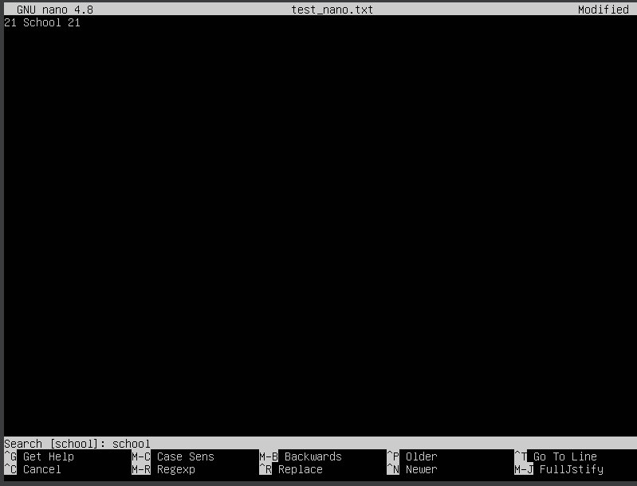

- Замена слова в nano- `Alt+R`, затем `Y`.

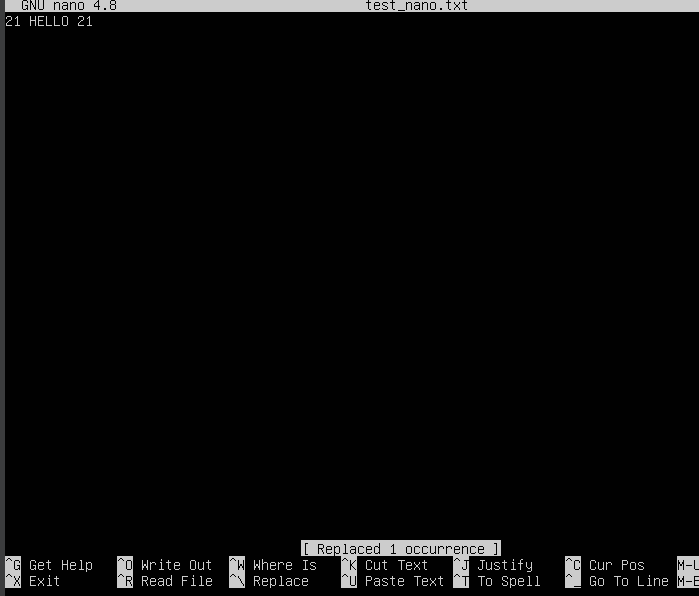

- Поиск слов в mcedit- `F7`, затем `F`(Find all).

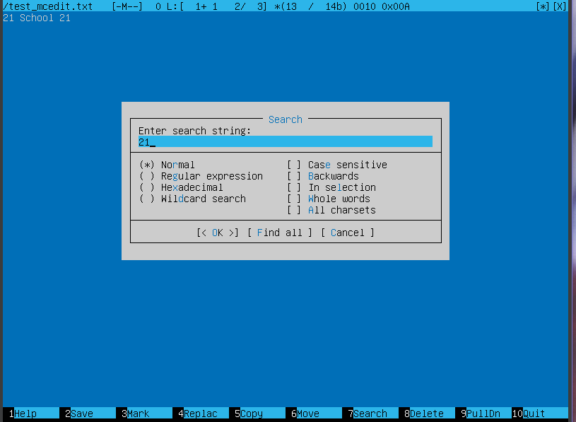

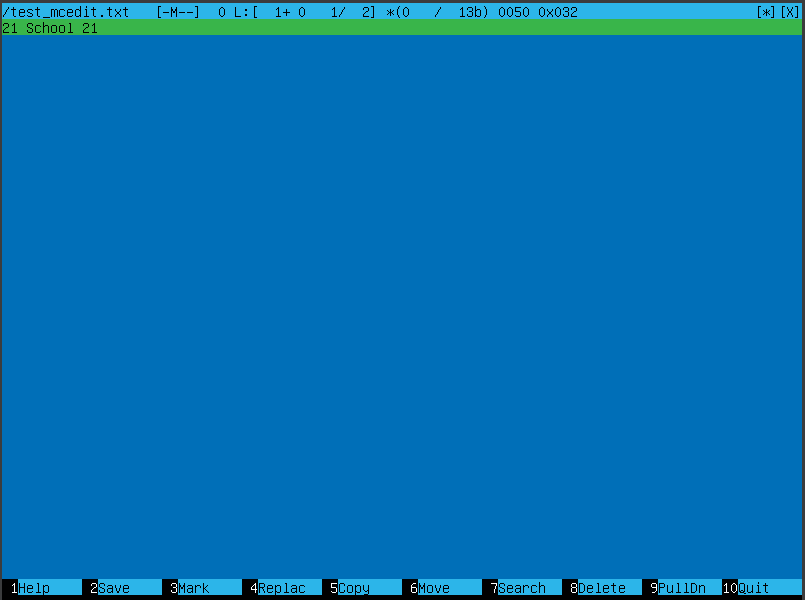

- Замена слова в mcedit- `F4` +`O`(Ok) + `R`(Replace).

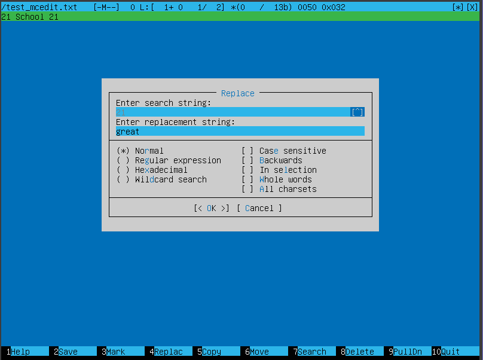

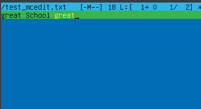

## Part 8. Установка и базовая настройка сервиса SSHD

- Командой `sudo apt install openssh-server` установим службу SSHd.

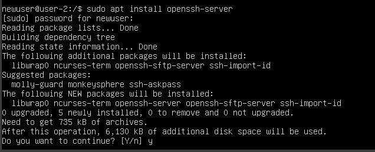

- Чтобы включить автостарт можно воспользоваться командой `sudo systemctl enable ssh`.

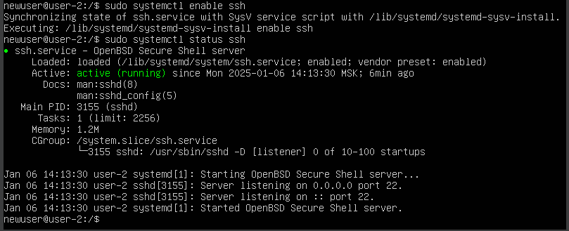

- Чтобы перенастроить службу SSHd на порт 2022, введем команду `sudo nano /etc/ssh/sshd_config`. Далее заменяем #Port 22 на Port 2022.

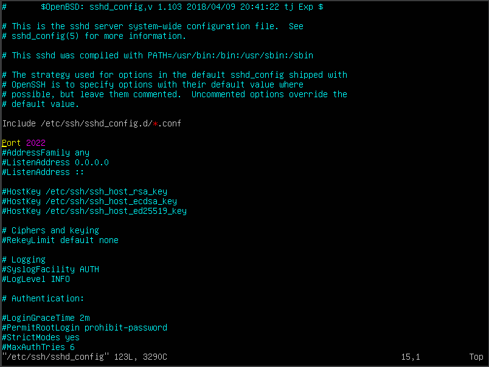

- Используя команду `ps aux | grep sshd`, покажем наличие процесса sshd.

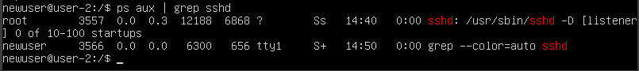

Для мониторинга процессов в Linux предназначена команда ps. aux состоит из трех опций: опция a обеспечивает отображение всех процессов, опция u предоставляет расширенную информацию об использовании, а опция x показывает, с какого TTY и каким пользователем запускается процесс.

- Перезапустим сервер командой `sudo systemctl restart ssh` и проверим изменения командой `netstat -tulpan | grep 2022`.
- Введем команду `netstat -tan`.

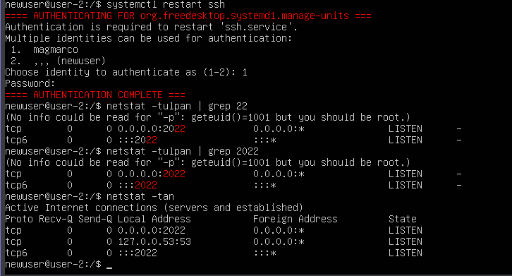

- Netstat, сокращение от “статистика сети”, - это инструмент командной строки в Linux, который предоставляет подробную информацию о сетевых подключениях, таблицах маршрутизации, статистике сетевого интерфейса. 
    - t: показывает TCP-соединения;
    - a: отображает все активные подключения и порты прослушивания;
    - n: отображает адреса и номера портов в числовой форме, а не преобразует их в имена хостов и служб.

- Значение каждого столбца вывода `netstat -tan`:
    - Proto — сетевой протокол (tcp, udp);
    - Recv-Q — количество байтов, помещённых в буфер приёма TCP/IP, но не переданных приложению;
    - Send-Q — количество байтов, помещённых в буфер отправки TCP/IP, но не отправленных, или отправленных, но не подтверждённых;
    - Local Address — локальный адрес сервера;
    - Foreign Address — адрес второй стороны;
    - State - состояние соединения (LISTEN, ESTABLISHED, etc.).

Значение 0.0.0.0 в Local Address и Foreign Address означает, что подключаться можно с любых адресов и с любых портов.

## Part 9. Установка и использование утилит top, htop

- По выводу команды top определи и напиши в отчёте:
    - uptime- 10 min;
    - количество авторизованных пользователей- 1;
    - среднюю загрузку системы- 0.00;
    - общее количество процессов- 101;
    - загрузку cpu- 0.3% 
    - загрузку памяти- 160.3 из 1971.6;
    - pid процесса занимающего больше всего памяти- 1;
    - pid процесса, занимающего больше всего процессорного времени- 3580;

- Нажав на `F6`, выбираем параметр сортировки.
- Скрин с выводом команды htop отсортированный по PID:

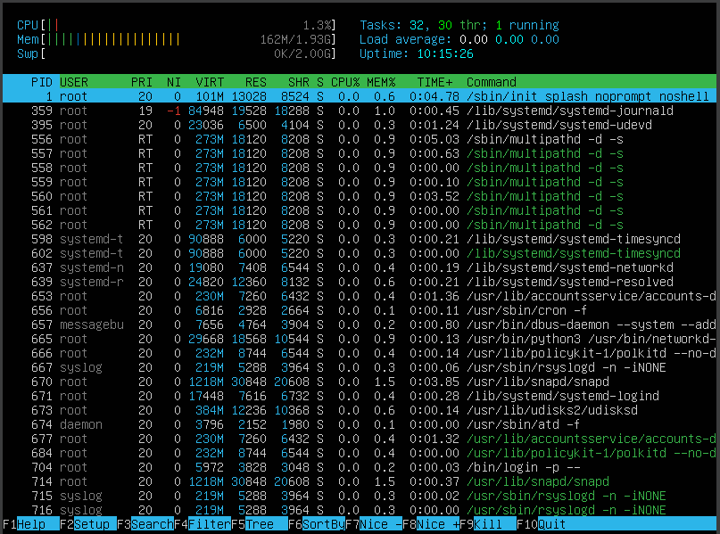

- Скрин с выводом команды htop отсортированный по PERCENT_CPU:

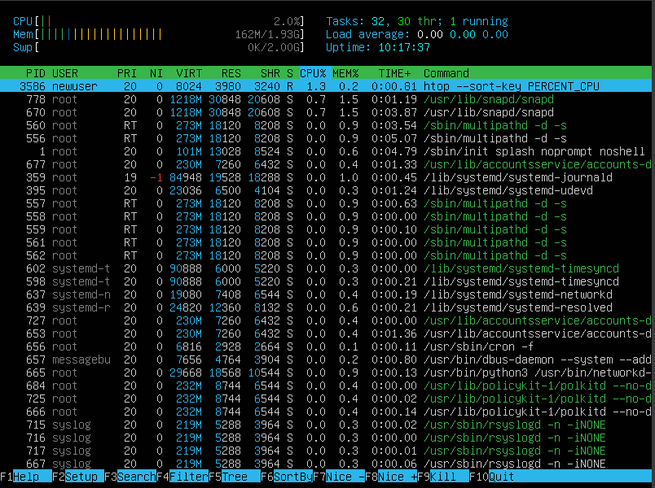

- Скрин с выводом команды htop отсортированный по PERCENT_MEM:

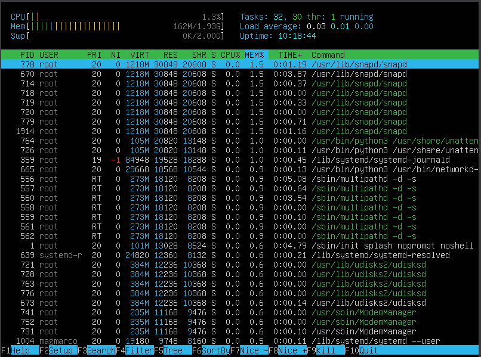

- Скрин с выводом команды htop отсортированный по TIME:

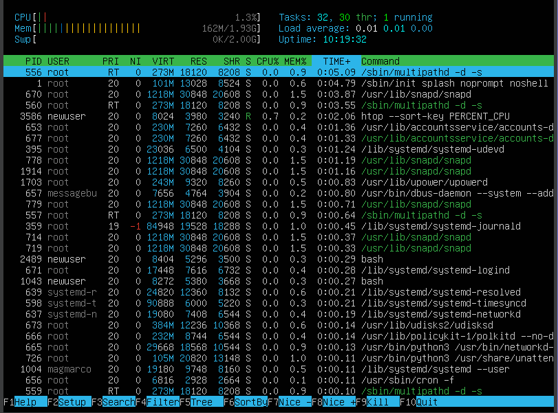

- Отфильтрованный htop для процесса sshd:

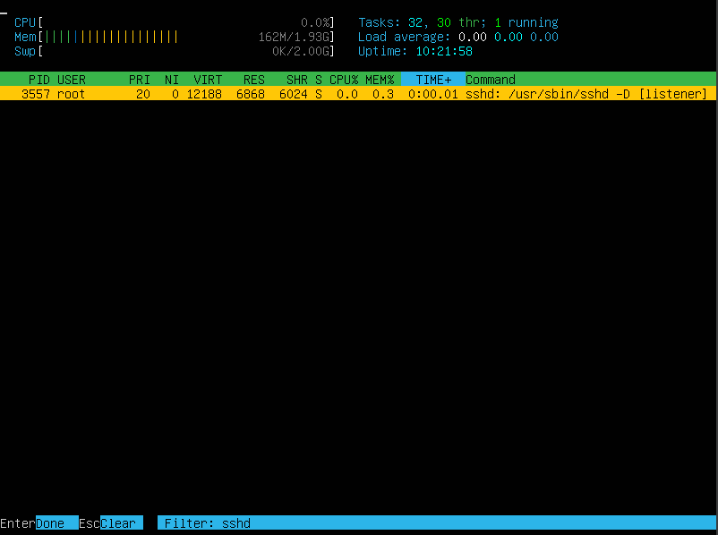

- Скрин с процессом syslog, найденным, используя поиск:

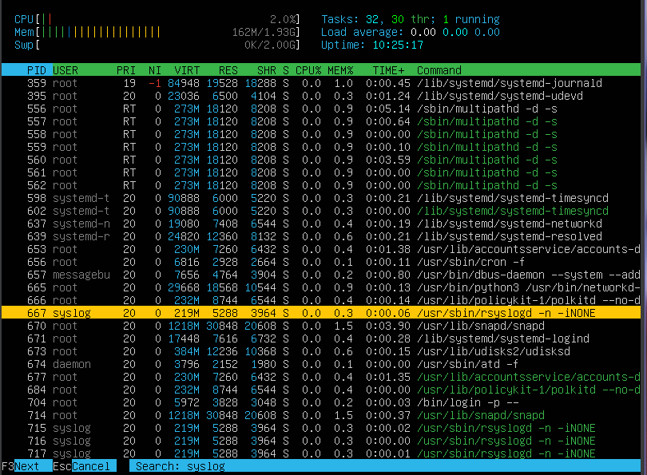

- Скрин с добавленным выводом hostname, clock и uptime:

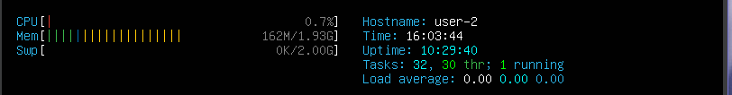

## Part 10. Использование утилиты fdisk

- Запустим команду fdisk -l.

    - название жесткого диска- VBOX HARDDISK
    - размеp- 25 Гб
    - количество секторов- 52428800.

- Запустим команду swapon -s.

    - размер swap- 2097148 Кб

## Part 11. Использование утилиты df

- Запустим команду df.
    - В отчёте напиши для корневого раздела (/):
        - размер раздела: 11758760
        - размер занятого пространства: 4882968
        - размер свободного пространства: 6256684
        - процент использования: 44%
        - единица измерения- кибибайты.

- Запустим команду df -Th.
    - В отчёте напиши для корневого раздела (/):
        - размер раздела: 12 Гб
        - размер занятого пространства: 4.7 Гб
        - размер свободного пространства: 6 Гб
        - процент использования: 44%
        - тип файловой системы: ext4.

## Part 12. Использование утилиты du

- Запустим команду du.

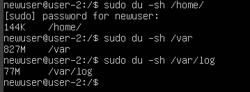

- Запустим команду du /var/log/*

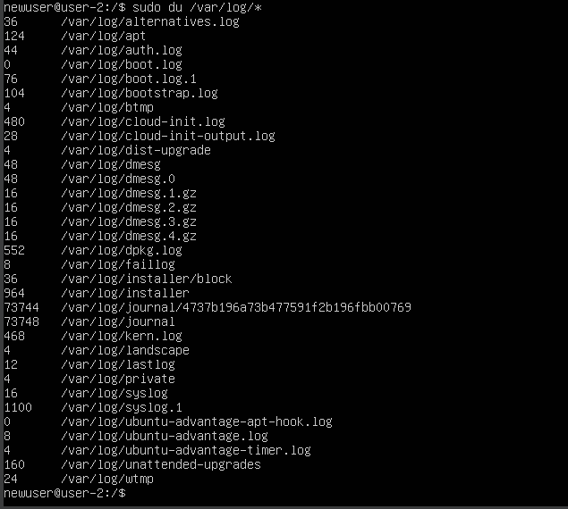

## Part 13. Установка и использование утилиты ncdu

- Установим утилиту ncdu командой `sudo apt install ncdu`.

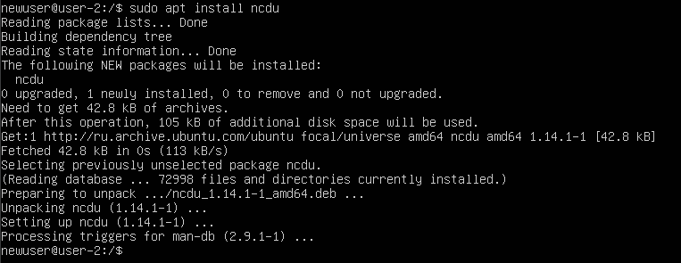

- Выведем размер папки /home.

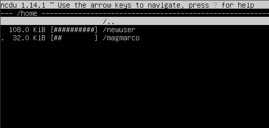

- Выведем размер папки /var.

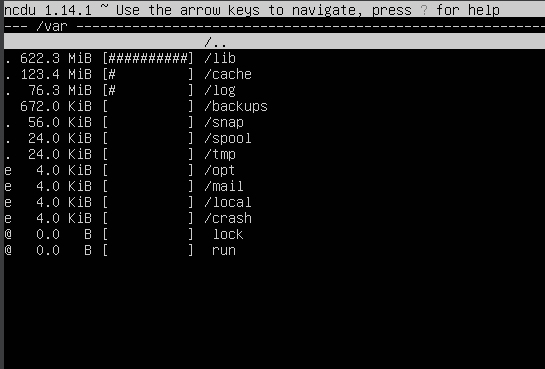

- Выведем размер папки /var/log.

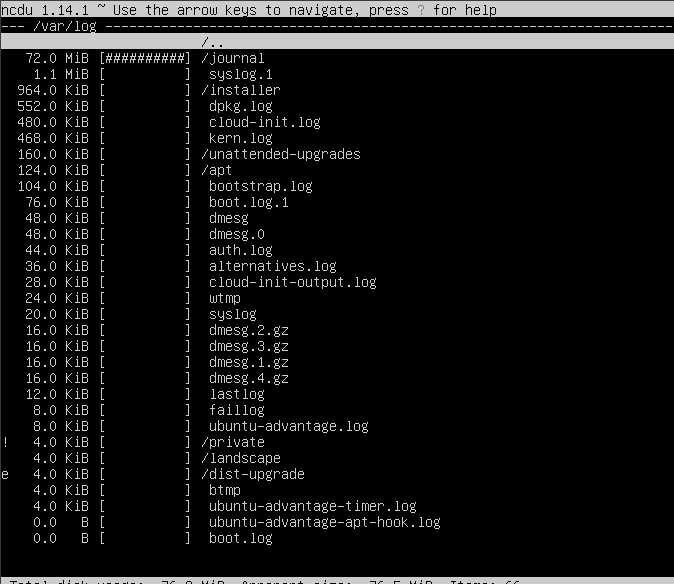

## Part 14. Работа с системными журналами

 - Время последней успешной авторизации: Jan 7 18:13:06
 - Имя пользователя: newuser
 - Метод входа в систему: uid=1000

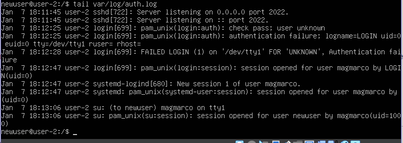

- Перезапустим службу SSHd командой `sudo systemctl restart ssh`.

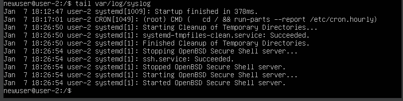

## Part 15. Использование планировщика заданий CRON

- Используя планировщик заданий, запустим команду uptime через каждые 2 минуты. Откроем `CRON` и отредактируем файл с помощью команды `crontab -e`.
- Добавим строчку */2 * * * * uptime.

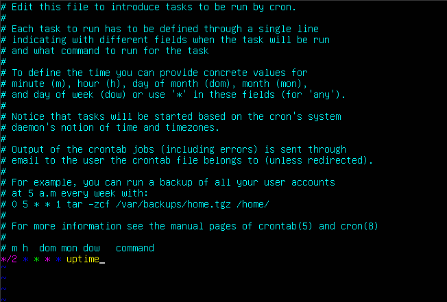

- Откроем системный журнал.

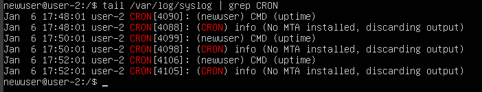

- Выведем на экран список текущих заданий для CRON с помощью команды `crontab -l`.

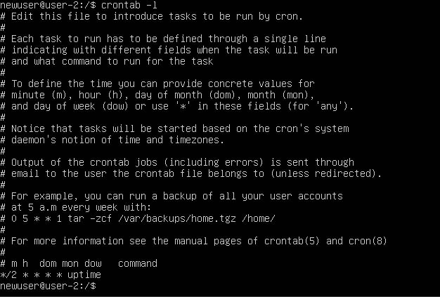

- Удалим все задания из планировщика заданий. Проверим текущие задачи.

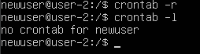